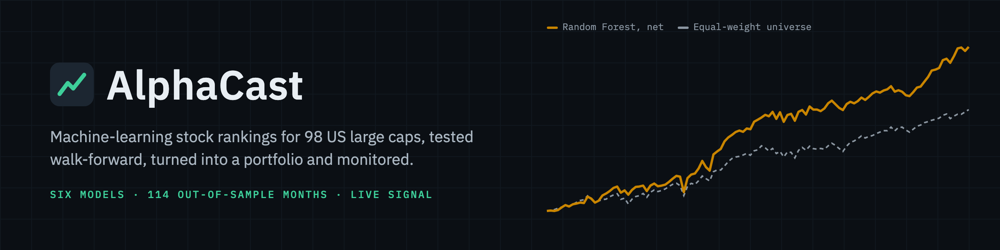
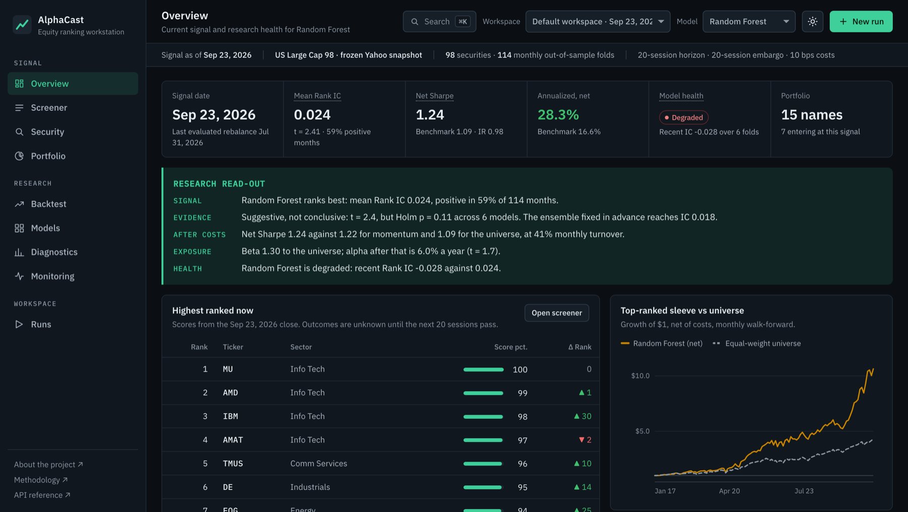
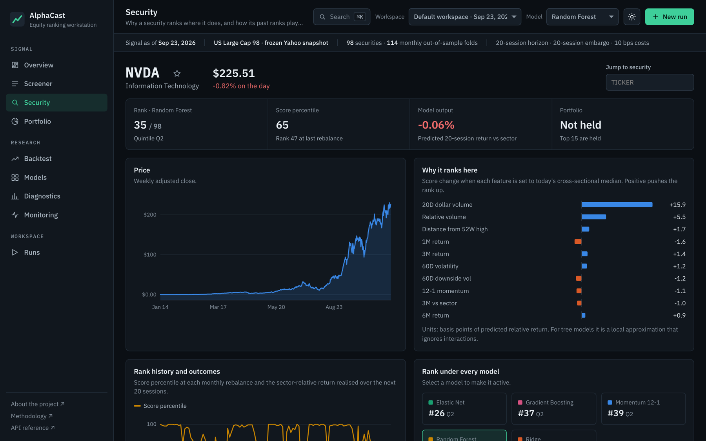

<p align="center">
  
</p>

# AlphaCast

**A machine-learning equity ranking workstation: rank 98 US large caps against their sector, test six models walk-forward, turn the signal into a cost-aware portfolio, and keep monitoring it.**

[Launch AlphaCast](https://alphacast.onrender.com) · [Read the case study](https://www.nathan-gomes.com/Project-AlphaCast.dc.html) · [Methodology](docs/METHODOLOGY.md) · [API reference](https://alphacast.onrender.com/api/docs)

The live app opens on the latest signal from a Yahoo Finance snapshot that refreshes weekly. It ranks; it does not forecast prices, place trades, or give investment advice.

[](https://github.com/Nathan-Gomes/alphacast/actions/workflows/test.yml)
[](https://github.com/Nathan-Gomes/alphacast/actions/workflows/refresh-data.yml)




*The Overview: the latest signal, the active model's out-of-sample record and health, and a five-point read-out generated from the results.*

---

## What this is

Three things, in one repository.

**A research engine.** Fourteen trailing price and volume features, ranked within each date, feed six models (a 12-1 momentum baseline, Ridge, Elastic Net, Random Forest, gradient boosting and an equal-weight ensemble) on 114 monthly folds with a 20-session embargo. Every result is judged as a ranking: Rank IC with Holm-adjusted p-values, quintile spreads, beta and alpha, and a shuffled-data placebo that must find nothing.

**A workstation.** A multi-view application for using the signal: today's ranks and why, the portfolio they imply, how the backtest held up after costs, where the model works, and whether it is degrading. Studies with different data, costs and portfolio rules run in the background and can be compared side by side.

**An honest answer.** Random Forest has the strongest ranking signal (Rank IC 0.024), but it is suggestive rather than conclusive once six models are compared, about half its outperformance is market exposure (beta 1.30), and it has weakened over the last six months. The app shows all of that rather than hiding it.

## What it does

| View | Purpose |
|---|---|
| **Overview** | Latest signal, active model's out-of-sample record and health, generated read-out, top and bottom ranks, watchlist |
| **Screener** | Full cross-section with score percentile, model output, model consensus, rank change and factor profile; search, filter, watchlist, CSV export |
| **Security** | One-sentence explanation of the rank, per-feature attribution, price path, rank history against realised outcomes, rank under every model, sector rank and peers |
| **Portfolio** | Top-ranked sleeve at the latest close: weights, entries and exits, implied turnover and cost, sector allocation, factor tilts |
| **Backtest** | Net and gross growth, drawdown, rolling active return, turnover, cost sensitivity with break-even costs, book-size robustness (5 to 30 names), period table |
| **Models** | All models on identical folds: IC, t-stat, Holm-adjusted p-value, Sharpe, turnover, cumulative IC, today's rank agreement, feature reliance, declared specifications |
| **Diagnostics** | Monthly Rank IC, quintile returns, IC distribution, signal decay across horizons, within-sector skill and tilt, regime breakdown |
| **Monitoring** | Health status per model (recent IC tested against the earlier record in standard errors), rolling IC against a historical band, reliance drift, feature drift (PSI) |
| **Report** | One-page research memo for the active model: bottom line, key figures, growth, every model on the same folds, current book, setup and limits; prints to a two-page PDF |
| **Runs** | Background studies (frozen snapshot, live Yahoo Finance, or synthetic) with time estimates and portfolio rules (rebalance cadence, holding buffer, sector cap); headline results, side-by-side run comparison, JSON export |

Press <kbd>⌘K</kbd> / <kbd>Ctrl K</kbd> or <kbd>/</kbd> anywhere to jump to a ticker, view or model. Links keep the active model and run, charts can be read with the arrow keys, and dotted-underlined metrics explain themselves on hover or focus.



## Findings on the default workspace

98 US large caps, 114 monthly out-of-sample folds from February 2017 to July 2026, 10 bps one-way costs, equal-weight top 15:

| Model | Mean Rank IC | t-stat | Net Sharpe | Turnover / month |
|---|---:|---:|---:|---:|
| Random Forest | 0.024 | 2.41 | 1.24 | 41% |
| Ensemble (declared in advance) | 0.018 | 1.64 | 1.07 | 42% |
| Gradient Boosting | 0.010 | 0.97 | 1.06 | 57% |
| Elastic Net | 0.010 | 0.80 | 0.90 | 35% |
| Ridge | 0.010 | 0.75 | 0.80 | 46% |
| Momentum 12-1 (baseline) | 0.006 | 0.37 | 1.22 | 25% |
| Equal-weight universe | | | 1.09 | |

Random Forest has the only t-statistic above 2 (p = 0.018), but adjusted for comparing six models its p-value is 0.11: suggestive, not conclusive. Its sleeve also has a beta of 1.30 to the universe; after removing that exposure its alpha is about 6% a year (t = 1.7), no larger than momentum's. The result is not an artefact of holding 15 names: from 5 to 30 names its net Sharpe stays between 1.15 and 1.28, and active return rises as the book concentrates. The other models do not clearly beat momentum after turnover. As of the September 2026 signal, every model's last six folds sit below its earlier record, so the monitoring view puts all six on watch; none of the drops is larger than 1.6 standard errors, so none counts as degraded yet. Because Random Forest was singled out after seeing the results, the ensemble, fixed in advance, is the fairer estimate of what machine learning adds here. The signal is modest and it is not stationary.

## How it works

```text
Daily adjusted prices and volume (98 stocks, 2014-2026)
-> data-quality gate (drops sessions with <90% coverage)
-> 14 trailing features, rank-normalised within each date
-> target: next 20-session return minus the stock's sector return
-> monthly expanding-window folds, 20-session embargo
-> Momentum · Ridge · Elastic Net · Random Forest · Gradient Boosting · Ensemble
-> Rank IC, quintiles, top-15 sleeve net of costs, regimes
-> live scoring of the latest close, attribution, drift and health checks
```

- **Leakage control:** features use data through the decision close; labels start the next session; training stops 20 sessions before each test date.
- **Training efficiency:** training rows are sampled weekly (consecutive 20-day labels overlap by 19 days) and models refit every third month. A stale fit only uses older data, so it cannot leak.
- **Attribution:** score change when a feature is set to the date's median. Exact for linear models; a local approximation for trees.

See [docs/METHODOLOGY.md](docs/METHODOLOGY.md) for equations and design choices.

## Data freshness

A scheduled workflow (`.github/workflows/refresh-data.yml`) downloads prices every Saturday, refuses a snapshot with fewer than 95 tickers, rebuilds the default workspace, runs the tests and commits only when new sessions arrived. Add the Render deploy hook as a `RENDER_DEPLOY_HOOK` repository secret to redeploy automatically.

## Run locally

```bash
python -m venv .venv
.venv/bin/pip install -e '.[dev]'
.venv/bin/uvicorn alphacast.app:app --reload
```

Open `http://127.0.0.1:8000`. The default workspace loads from `src/alphacast/snapshots/default_run.json.gz`. The API reference is at `/api/docs`.

```bash
.venv/bin/python -m pytest                      # Python test suite
node --test tests/js/*.test.mjs                 # interface logic tests
python scripts/a11y_audit.py --axe node_modules/axe-core/axe.min.js --base http://localhost:8000   # axe audit (CI runs it)
.venv/bin/python scripts/build_default_run.py   # rebuild the default workspace (~80 s)
.venv/bin/python scripts/refresh_snapshot.py    # re-download the frozen price snapshot
.venv/bin/alphacast --source snapshot --output output/run.json   # CLI run
```

## Reproducibility

The default workspace is deterministic: the price snapshot is frozen in the repository, every model has a fixed seed, and hyperparameters are declared in source. Rebuilding it with `scripts/build_default_run.py` reproduces the committed `default_run.json.gz` exactly apart from its creation timestamp, so every figure in this README, the case study and the app can be regenerated from a clean checkout.

## API

| Method | Path | |
|---|---|---|
| GET | `/api/catalog` | Universes, models, data sources, defaults |
| GET | `/api/runs` | Runs in memory with status and progress |
| POST | `/api/runs` | Start a run in the background (returns 202) |
| GET | `/api/runs/{id}` | Run status and, once complete, the workspace |
| GET | `/api/runs/{id}/securities/{ticker}` | Price path, rank history, attribution for one stock |
| GET | `/api/runs/{id}/export` | Download the workspace as JSON |

## Limits

- The universe is today's large caps, not point-in-time index membership, so results carry survivorship bias.
- Yahoo Finance is convenient public history, not an institutional point-in-time source.
- There are no fundamentals, delisting returns, borrow costs, taxes, or spread and impact model.
- The portfolio is an equal-weight sleeve with no sector constraints or optimizer.
- Runs live in server memory and reset when the service restarts.
- Historical results do not establish future returns.

## Deploy

`Dockerfile` and `render.yaml` define a Render web service; the health check is `/api/health`. The public demo has no authentication. Do not use it with proprietary data.
